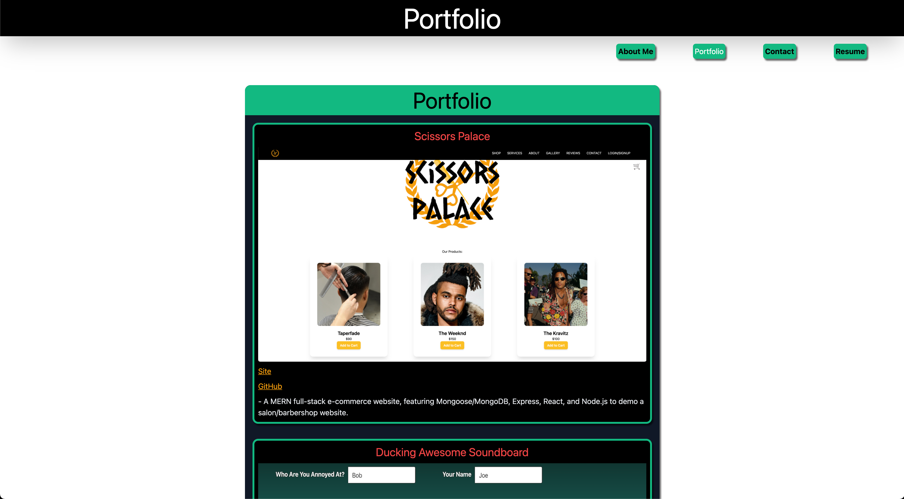

# React Portfolio

 
 

## **Description**
* A collection of all my work over my career as a full stack developer created with React.js.
 
 

## **Table of Contents**
- [Installation](#Installation)  
- [Usage](#Usage)  
- [License](#License)  
- [Contributing](#Contributing)  
- [Tests](#Tests)  
- [Questions](#Questions)  
 
 

## **Installation**
* There is no installation.
 
 

## **Usage**
* a way to display the work that I've done over my career and with using react making it easier to add new content while keeping the site fast and responsive.
 
 

## **License**
### *MIT*  
        A short and simple permissive license with conditions only requiring preservation of copyright and license notices. Licensed works, modifications, and larger works may be distributed under different terms and without source code.
 

## **Contributing**
* No contributions at this time.
 
 

## **Tests**
    
* No tests
 
 

## **Questions**
* GitHub: https://github.com/KevinHenleyCode

* For more questions you can reach me at my Email:(kevinhenleyinfo@gmail.com)

 
 

## **Screenshot**

 
 

 
 

## **Links**
[Site](https://kevinhenleycode.github.io/React_Portfolio/)
