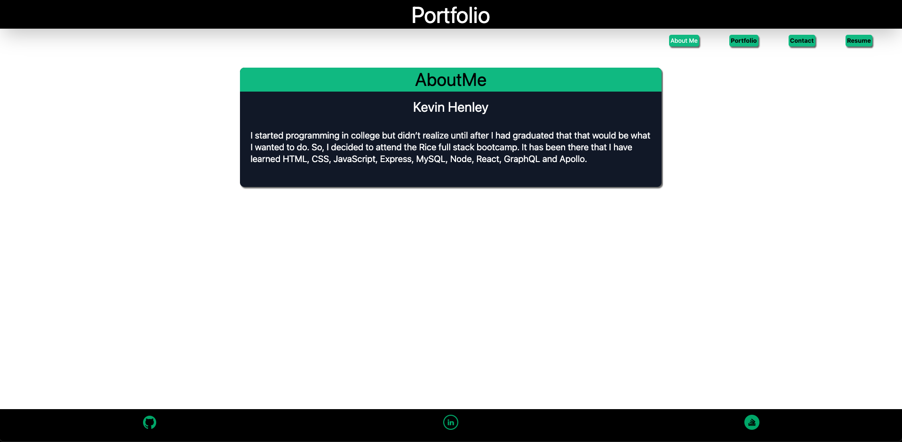

# React Portfolio

 
 

## **Description**
* My portfolio built in React.JS.
 
 

## **Table of Contents**
- [Installation](#Installation)  
- [Usage](#Usage)  
- [License](#License)  
- [Contributing](#Contributing)  
- [Tests](#Tests)  
- [Questions](#Questions)  
 
 

## **Installation**
* There is no installation.
 
 

## **Usage**
* This makes it much easier to go back an add new thing with Reacts great modularity.
 
 

## **License**
### *MIT*  
        A short and simple permissive license with conditions only requiring preservation of copyright and license notices. Licensed works, modifications, and larger works may be distributed under different terms and without source code.
 

## **Contributing**
* No contributions at this time.
 
 

## **Tests**
    
* No tests
 
 

## **Questions**
* GitHub: https://github.com/KevinHenleyCode

* For more questions you can reach me at my Email:(kevinhenleyinfo@gmail.com)

 
 

## **Screenshot**

 
 

## **Links**
[Site](https://kevinhenleycode.github.io/React_Portfolio/)
